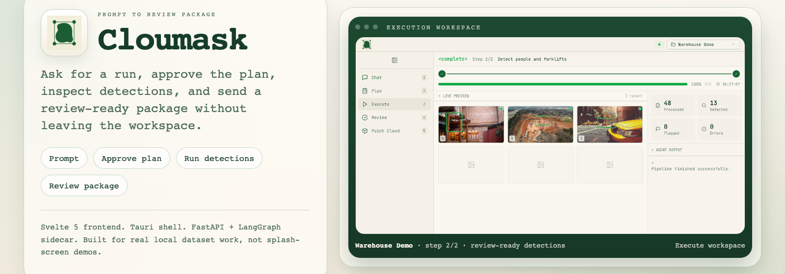
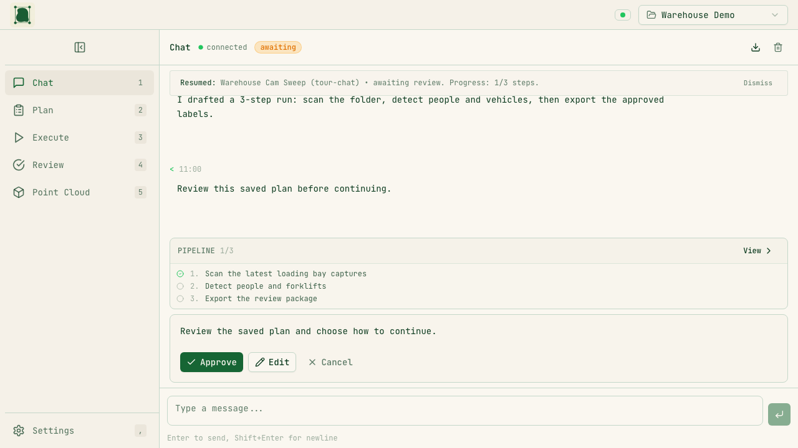
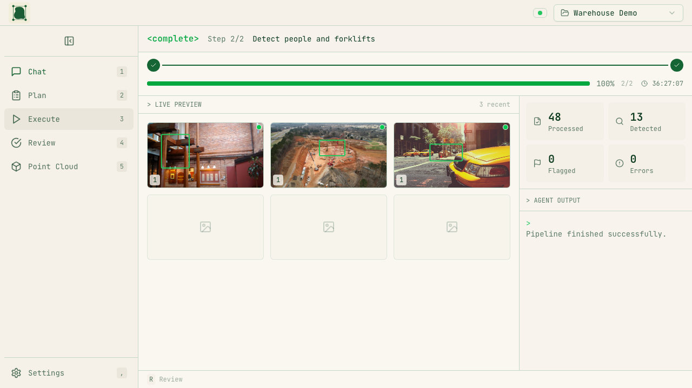
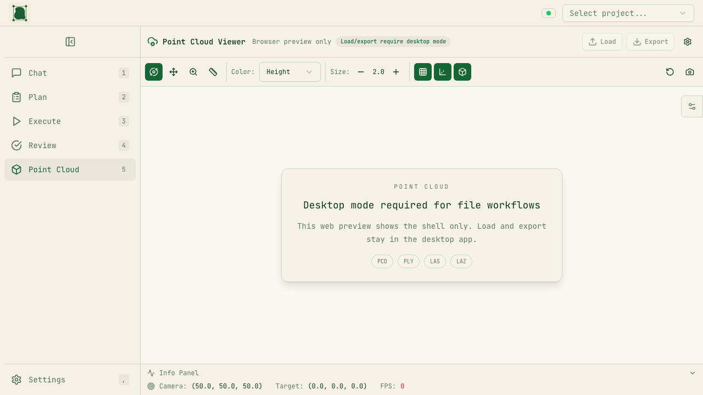

# Cloumask



Cloumask is a local-first computer-vision workbench for dataset prep and review.

It combines:
- A Svelte 5 frontend (`src/`)
- A Rust/Tauri shell (`src-tauri/`) for desktop packaging and native bridge commands
- A FastAPI + LangGraph backend sidecar (`backend/`) using local Ollama models

## Product Tour

**Chat workspace**

Start a local vision run, keep first-step guidance visible, and move from prompt to plan without leaving the shell.



**Execution workspace**

Finished runs keep previews, counts, and agent output together so you can sanity-check results before moving into review.



**Point-cloud browser preview**

Web mode now explains the desktop-only file workflow instead of leaving a blank viewport with unexplained controls.



> Sample data attribution: `static/readme/demo/*.jpg` contains bundled demo stills used for README and capture work inside this repository.

## Architecture

```text
Web mode
  Browser (SvelteKit) ──HTTP/SSE──> FastAPI sidecar ──> LangGraph agent ──> Ollama

Desktop mode
  Tauri shell + Svelte UI ──IPC/HTTP──> Rust sidecar manager ──> FastAPI sidecar
                                                  └──────────> native point-cloud commands
```

Reference: `docs/ARCHITECTURE_TECH_FIT_AUDIT.md`

## Repository Layout

```text
src/                 Svelte frontend
src-tauri/           Rust/Tauri desktop shell + sidecar management
backend/             FastAPI API, agent graph, CV/data tools
docs/                Architecture, plans, testing docs
tests/               Playwright end-to-end tests
```

## Quickstart

### Prerequisites

- Node.js 20+
- Python 3.11+
- Rust (for desktop builds/dev)
- Ollama (for local model-backed agent flows)

### Install

```bash
npm install
# Creates backend/.venv and installs core + agent + CV Python dependencies
npm run backend:install
```

### Start (web mode)

```bash
# Terminal 1
npm run backend:dev

# Terminal 2
npm run dev
```

Open `http://localhost:5173`.

## Run modes

### Web mode (recommended dev loop)

Use the Quickstart commands above (`npm run backend:dev` + `npm run dev`).

### Desktop mode

```bash
npm run tauri:dev
```

### Desktop build

```bash
npm run tauri:build
```

## Verify

Project gate:

```bash
just ci
```

Equivalent manual checks:

```bash
npm run check
npm test -- --run
cd backend && PYTHONPATH=src pytest -q
cd src-tauri && cargo test
```

## Troubleshooting

### `dyld: Library not loaded ... libsimdjson.26.dylib`

Your Node runtime is linked against a missing Homebrew library.

1. Reinstall Node (or your version manager runtime).
2. Reinstall/update `simdjson` via Homebrew.
3. Re-run `npm install`.

### Backend not reachable on `127.0.0.1:8765`

- Confirm backend is running: `npm run backend:dev`
- Check health endpoint: `curl -fsS http://127.0.0.1:8765/health`

### Ollama/model errors

- Ensure Ollama daemon is running.
- Confirm model availability in Ollama.
- Optional model override:

```bash
CLOUMASK_OLLAMA_MODEL=qwen3:14b npm run backend:dev
```

### Port conflicts

Default ports:
- Frontend: `5173`
- Backend: `8765`
- Ollama: `11434`

Free the conflicting process or stop existing dev sessions.

## Docs

- `docs/ARCHITECTURE_TECH_FIT_AUDIT.md`
- `docs/plan/README.md`
- `docs/testing/PLAYWRIGHT_FULL_QA_SCENARIOS.md`
- `backend/README.md`
- `CONTRIBUTING.md`

## Contributing

Please read `CONTRIBUTING.md` before opening issues or pull requests.

Basic flow:

1. Create a feature branch.
2. Make focused, test-backed changes.
3. Run the verify gate (`just ci`).
4. Open a PR with clear scope and validation notes.

## License

MIT
