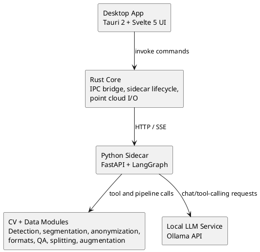

# Cloumask

Local-first agentic computer vision data processing for images, video, and point clouds.

From cloud to canvas.

## Project Status

Cloumask core development is complete through `06-data-pipeline`.

| Area | Status |
|------|--------|
| Foundation (Tauri + FastAPI + IPC) | Complete |
| Agent System (LangGraph + tools + checkpoints) | Complete |
| CV Models (2D anonymization/detection/segmentation) | Complete |
| Frontend UI (chat/plan/execute/review/point cloud views) | Complete |
| Point Cloud (I/O, processing, fusion, 3D tools) | Complete |
| Data Pipeline (formats, QA, split, augmentation, duplicates) | Complete |
| Release Engineering (packaging/distribution hardening) | In progress |

## Architecture



## Implemented Capabilities

### Agent and Orchestration
- Conversational planning with clarify-plan-execute flow
- Human-in-the-loop checkpointing and resume support
- Tool registry for CV, data pipeline, and point cloud operations
- Streaming execution updates over SSE

### CV and Privacy
- Face and plate anonymization workflows
- 2D object detection and segmentation tool integrations
- 3D detection, projection, and point-cloud anonymization routes/tools

### Data Pipeline
- Import/export: YOLO, COCO, KITTI, Pascal VOC, CVAT, nuScenes, OpenLABEL
- Duplicate and similarity detection (hash-based + embedding-based options)
- Label QA checks with report generation
- Dataset splitting (train/val/test, stratified, CV folds)
- Dataset augmentation via Albumentations

### Frontend
- Chat, plan editor, execution monitoring, review queue
- Point cloud viewer and related controls
- Keyboard-driven workflows and command palette
- Design system aligned to current brand tokens:
  - Primary `#166534` (forest green)
  - Background `#FAF7F0` (cream)
  - Monospace-first typography

## Repository Layout

```text
src/                 Svelte frontend
src-tauri/           Rust shell and native commands
backend/             FastAPI sidecar, agent, CV/data pipeline
assets/              App icon and branding assets
docs/plan/           Phase specs and module plans
scripts/             Utility scripts
```

## Local Development

### Prerequisites
- Node.js 20+
- Rust 1.75+
- Python 3.11+
- Ollama (optional, required for local LLM chat/tool-calling)

### Setup

```bash
npm install
npm run backend:install
```

### Run

```bash
# Full desktop app (frontend + Rust + sidecar lifecycle)
npm run tauri:dev

# Frontend only
npm run dev

# Backend only (from repo root)
npm run backend:dev
```

## User Delivery

### Web App

```bash
# Terminal 1
npm run backend:dev

# Terminal 2
npm run dev
```

Open `http://localhost:5173`.

### Desktop App (Installer)

```bash
npm run tauri:build
```

Installer/artifacts are generated in:

- `src-tauri/target/release/bundle/dmg/Cloumask_0.1.0_aarch64.dmg`
- `src-tauri/target/release/bundle/macos/Cloumask.app`

### First-Run Wizard UX

- First launch runs an in-app setup wizard (no CLI steps required).
- The wizard validates prerequisites and handles model setup in-app.
- If the required AI model is missing, users can:
  - `Download now (recommended)`, or
  - `Continue without model` and let Cloumask auto-download on first AI use.

## Validation Commands

```bash
# Backend tests
cd backend && PYTHONPATH=src pytest -q

# Rust tests
cd src-tauri && cargo test

# Frontend static checks
npm run check

# Frontend tests (component + user flows)
npm test -- --run
```

Current known state (February 10, 2026):
- `backend`: `1309 passed, 39 skipped`
- `src-tauri`: `24 passed, 2 ignored`
- `npm run check`: `0 errors, 0 warnings`
- `npm test -- --run`: `10 passed`
- `npm run tauri:build`: macOS app bundle + DMG generated successfully

## Backend Endpoints

When running locally (`127.0.0.1:8765`):
- `GET /health`
- `GET /docs`
- LLM/agent, streaming, scripts, review, point cloud, ROS bag, 3D detect, fusion, and 3D anonymization routes under the FastAPI app

## Documentation

- [Project Description](PROJECT_DESCRIPTION.md)
- [Development Plan](docs/plan/README.md)
- [Data Pipeline Spec](docs/plan/06-data-pipeline/SPEC.md)
- [Backend Guide](backend/README.md)
- [Contributing Guide](CONTRIBUTING.md)

## License

MIT
