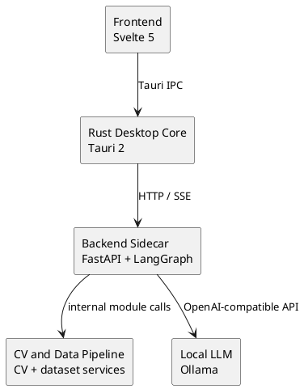

# Cloumask Development Plan

> Status: Core development complete (phases 1-6 implemented)
> Last Updated: February 10, 2026
> Release Engineering: In progress (packaging and distribution hardening)

This plan tracks implementation status for Cloumask modules and release readiness.

## Architecture

## Module Status

| Module | Status | Priority | Spec |
|--------|--------|----------|------|
| Foundation | Complete | P0 | [SPEC](./01-foundation/SPEC.md) |
| Agent System | Complete | P0 | [SPEC](./02-agent-system/SPEC.md) |
| CV Models | Complete | P0 | [SPEC](./03-cv-models/SPEC.md) |
| Frontend UI | Complete | P1 | [SPEC](./04-frontend-ui/SPEC.md) |
| Point Cloud | Complete | P1 | [SPEC](./05-point-cloud/SPEC.md) |
| Data Pipeline | Complete | P1 | [SPEC](./06-data-pipeline/SPEC.md) |

## Development Phases

### Phase 1: Foundation
- [x] Initialize Tauri 2.0 + Svelte 5 project
- [x] Set up Python sidecar with FastAPI
- [x] Configure sidecar lifecycle management
- [x] Implement core IPC flow (Frontend <-> Rust <-> Python)
- [x] Verify Ollama integration path

### Phase 2: Agent Brain
- [x] Set up LangGraph state machine
- [x] Implement tool calling via Ollama integration
- [x] Add core tools and registry
- [x] Add approval/checkpoint nodes
- [x] Enable streaming updates and checkpoint persistence

### Phase 3: CV Features
- [x] Face detection and anonymization
- [x] Object detection and segmentation integration
- [x] Batch processing and progress reporting
- [x] Review-flow integration for outputs

### Phase 4: Frontend UI
- [x] Chat panel with streaming messages
- [x] Plan editor and pipeline step controls
- [x] Execution view with progress and previews
- [x] Review queue and annotation editing flows
- [x] Point cloud viewer integration

### Phase 5: Point Cloud and Fusion
- [x] Point cloud read/write and conversion support
- [x] Point cloud processing operations
- [x] ROS bag extraction support
- [x] 3D detection and 2D-3D projection tools
- [x] Point cloud anonymization paths

### Phase 6: Data Pipeline
- [x] Import/export across supported label formats
- [x] Duplicate and similarity detection
- [x] Label QA checks and report generation
- [x] Train/val/test split and CV fold generation
- [x] Augmentation support and preview

### Release Hardening (Current)
- [ ] Resolve frontend static-check backlog (`npm run check`)
- [ ] Final packaging and installer validation
- [ ] Final release documentation and distribution workflow

## Verification Snapshot

Latest local verification run (February 10, 2026):
- `cd backend && PYTHONPATH=src pytest -q` -> `1309 passed, 39 skipped`
- `cd src-tauri && cargo test` -> `24 passed, 2 ignored`
- `npm run check` -> frontend TypeScript/a11y/test-typing issues remain

## Quick Links

- [Project Description](../../PROJECT_DESCRIPTION.md)
- [Root README](../../README.md)
- [Backend README](../../backend/README.md)
